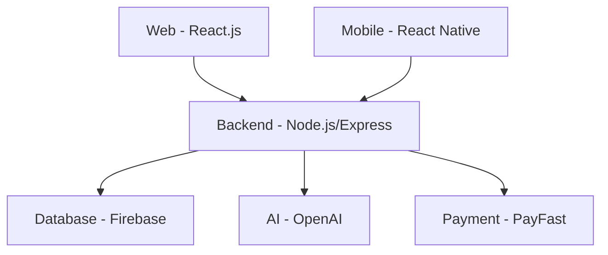

# Nzima-Admin-AI

Nzima-Admin-AI is a multi-platform admin and business management solution for African SMEs, powered by AI, with support for web, mobile, and backend integrations.

---

## Architecture



---

## Project Structure

```
Nzima-admin-AI/
│   README.md         # Main project documentation
│
├── backend/          # Node.js/Express backend (API, AI, payments)
├── web/              # React.js web frontend
├── mobile/           # React Native mobile app
├── shared/           # Shared logic (e.g., Firebase config, AI services)
├── firebase/         # Firebase service account/config
│
└── my-web-app/       # (Optional) Simple HTML/CSS/JS starter app
    ├── README.md
    ├── src/
    └── ...
```

---

## Getting Started

1. **Clone the repository:**
   ```sh
   git clone <repository-url>
   cd Nzima-admin-AI
   ```

2. **Setup environment variables:**
   - Create a `.env` file in `/backend` with your secrets (MongoDB/Firebase/OpenAI/PayFast keys).

3. **Install dependencies:**
   - Backend:  
     ```sh
     cd backend
     npm install
     ```
   - Web:  
     ```sh
     cd ../web
     npm install
     ```
   - Mobile:  
     ```sh
     cd ../mobile
     npm install
     ```

4. **Run the backend server:**
   ```sh
   cd backend
   npm start
   ```

5. **Run the web frontend:**
   ```sh
   cd ../web
   npm start
   ```

6. **Run the mobile app:**
   ```sh
   cd ../mobile
   npx react-native run-android # or run-ios
   ```

---

## Features

- **AI Document Generation** (OpenAI GPT-4)
- **Business Health Dashboard**
- **Payments & Wallet** (PayFast, Vouchers, Airtime)
- **Compliance Engine** (CIPC, SARS, etc.)
- **Multi-platform** (Web, Mobile)
- **African Localization** (ZAR, tax, languages)

---

## Implementation Notes

- **AI Integration:** Uses OpenAI GPT-4 for document generation, with caching and rate limiting.
- **Multi-Platform:** Shared Firebase config for web/mobile, React Context API for state management.
- **Localization:** ZAR currency formatting, South African tax calculations, RTL support for Arabic.
- **Security:** Firebase Authentication, role-based access control, HTTPS with strict CORS.
- **Compliance:** Built-in logic for CIPC, SARS, POPIA, and industry-specific requirements.

---

## Production Recommendations

- Set up CI/CD pipelines with GitHub Actions
- Implement end-to-end testing (Cypress, Detox)
- Use Firebase Cloud Functions for serverless operations
- Add performance monitoring (Sentry)
- Implement feature flags for gradual rollout

---

## Contributing

1. Fork the repo and create your branch.
2. Commit your changes and open a pull request.
3. Please follow the code style and add tests where possible.

---

## License

This project is licensed under the MIT License.

---

## Related Projects

- See `/my-web-app/README.md` for the simple HTML/CSS/JS starter app (optional).

---

## Source Code References

- **Backend:** [`/backend/server.js`](backend/server.js)
- **Shared Firebase Config:** [`/shared/firebase.js`](shared/firebase.js)
- **Web Dashboard Example:** [`/web/src/components/SmartDashboard.js`](web/src/components/SmartDashboard.js)
- **Mobile Document Generator:** [`/mobile/src/screens/DocumentGenerator.js`](mobile/src/screens/DocumentGenerator.js)
- **AI Service Example:** [`/shared/services/ai.js`](shared/services/ai.js)
- **Payment Integration Example:** [`/mobile/src/services/payment.js`](mobile/src/services/payment.js)
